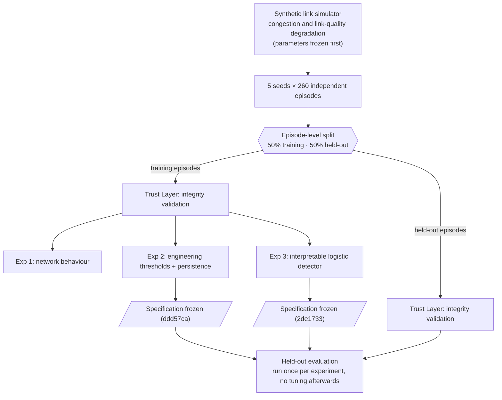
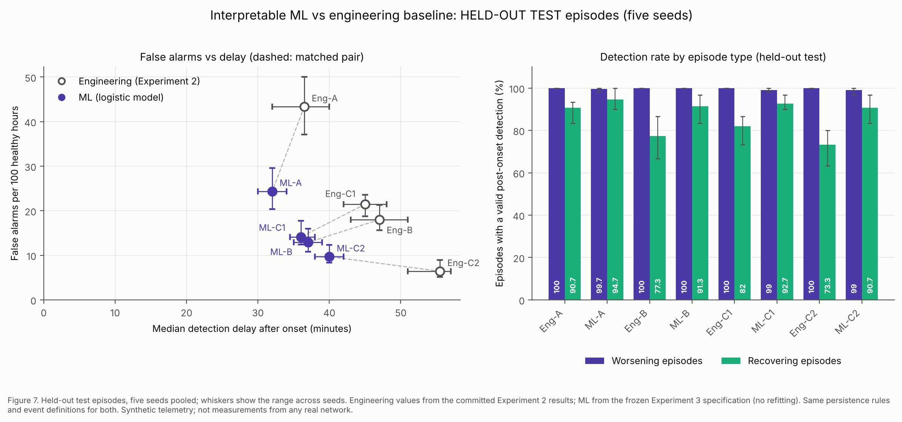
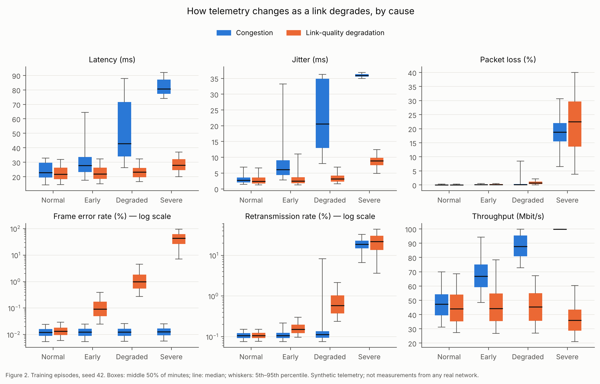
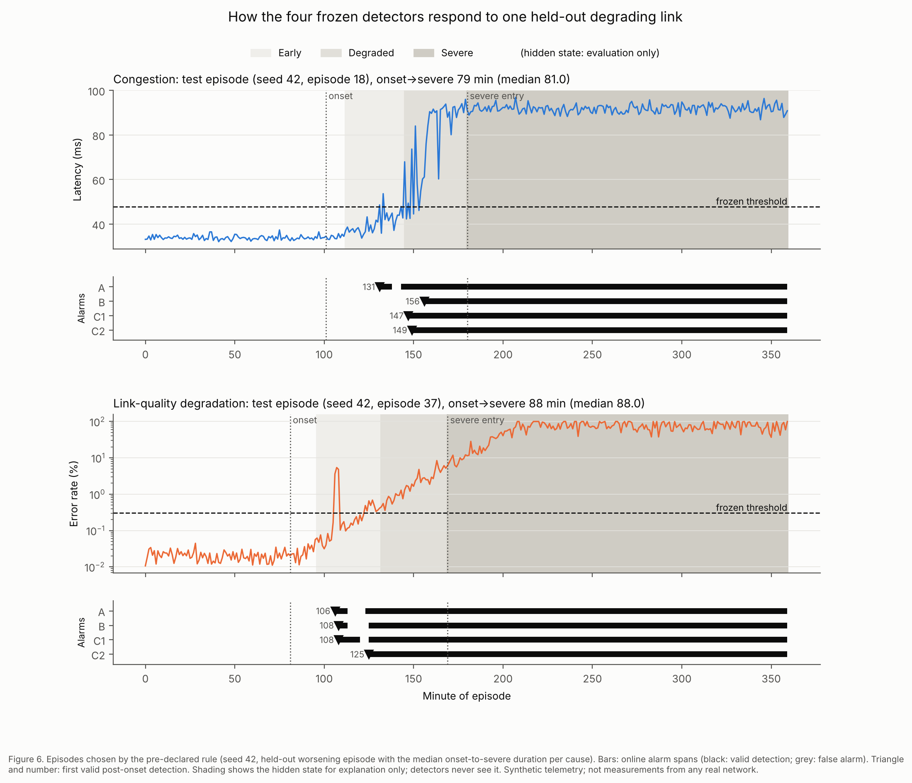

# NetSense-R

**ML-Assisted Degradation Detection and Reliability Analysis for Communication Networks**

A controlled reliability experiment on a simulated IP access/backhaul link. The telemetry is
validated first, then used to study how degradation appears in it. A transparent engineering
monitoring baseline is built, and an interpretable ML detector is tested on held-out
episodes to see whether it adds operational value.

<sub>The "R" stands for Reliability. This is a Python project and is unrelated to the R
language. All telemetry in this repository is synthetic.</sub>

**Research question.** How reliably can degradation in communication-link telemetry be
detected while keeping false alarms under control? And does an interpretable ML detector
improve on transparent engineering rules, or only shift the trade-off?

**Main held-out result** (synthetic telemetry; 650 held-out episodes over five simulator
seeds). Both detectors raise an alarm after 3 consecutive suspicious minutes (rule B):

| Rule B: alarm after 3 consecutive suspicious minutes | Engineering thresholds | Interpretable ML |
|---|---|---|
| False alarms per 100 healthy hours | 18.0 | **12.9** |
| Median detection delay | 47 min | **37 min** |
| Worsening episodes detected | 100% | 100% |
| Recovering episodes detected | 77.3% | **91.3%** |

B was the only one of four matched persistence settings in which ML met the improvement
criterion declared before testing. In the other three, ML introduced a trade-off: it received
detection credit for fewer worsening episodes, raised more false alarms, or both. The strictest
engineering rule remains the lowest-false-alarm option.
[Full results](#results) · [Safeguards](#experimental-safeguards) ·
[Methodology](docs/methodology.md)

## How the study is built



Each episode is one simulated link observed for six hours at one sample per minute. A hidden
severity value drives one of two mechanisms. In **congestion**, traffic approaches capacity
and queues build. In **link-quality degradation**, the link corrupts more frames. The link
then either worsens into severe degradation, rises and recovers, or stays stable apart from
harmless traffic and interference bursts. Detectors see only observable telemetry: latency,
jitter, loss, frame error rate, retransmissions and throughput. The hidden severity and the
state labels derived from it (`NORMAL`, `EARLY_DEGRADATION`, `DEGRADED`,
`SEVERE_DEGRADATION`) are used only for evaluation.

| Stage | Question | Why it is there |
|---|---|---|
| Simulator | Can controlled worsening and recovering mechanisms produce testable reliability scenarios? | Ground truth is known exactly, which real telemetry rarely allows |
| Trust Layer | Is a record structurally invalid, or only unusual? | Detectors should not be built on telemetry that has not been checked |
| Exp 1: Behaviour | How do the indicators change across states and mechanisms? | Shows what any detector is up against before one is built |
| Exp 2: Engineering baseline | Can thresholds plus persistence keep false alarms down, and at what cost? | A transparent reference that ML has to beat |
| Exp 3: Interpretable ML | Does combining signals with short causal history improve that trade-off? | Tests ML against the baseline, not against nothing |
| Held-out evaluation | Do the frozen detectors behave the same on unseen episodes? | Separates findings from fitting |

The **experimental unit is the episode**, not the telemetry row. Consecutive minutes from one
link are strongly related, so splitting by row would leak information between training and
test.

## Results

All results below are from **held-out episodes**: 300 worsening, 150 recovering and 200
stable (2,227 healthy hours), pooled over five seeds. The engineering detector flags a minute
when any of four indicators (latency, jitter, frame error rate, retransmissions) exceeds the
99th percentile of healthy training minutes. The ML detector is a logistic regression on 12
features built from the same four indicators: current value, 10-minute mean and 5-minute
trend. Its threshold was set on training data to match the engineering condition's healthy
trigger rate. Both use the same persistence rules, alarm-event logic and evaluation code.



**Engineering → ML, matched by persistence rule:**

| Persistence rule | False alarms / 100 h | Median delay | Worsening detected | Recovering detected | Pre-declared rule |
|---|---|---|---|---|---|
| A: any single minute | 43.4 → 24.4 | 36.5 → 32 min | 100% → 99.7% | 90.7% → 94.7% | trade-off |
| B: 3 consecutive minutes | 18.0 → 12.9 | 47 → 37 min | 100% → 100% | 77.3% → 91.3% | **ML meets rule** |
| C1: 3 of the last 10 | 21.5 → 14.1 | 45 → 36 min | 100% → 99.0% | 82.0% → 92.7% | trade-off |
| C2: 6 of the last 20 | 6.4 → 9.7 | 55.5 → 40 min | 100% → 99.0% | 73.3% → 90.7% | trade-off |

The rule, fixed before testing: ML improves on its engineering counterpart only if it
**either** lowers false alarms without lengthening delay **or** shortens delay without adding
false alarms, **and** it receives detection credit for no fewer worsening episodes.

- **A and C1:** fewer false alarms and shorter delay. Both are still classified as trade-offs
  because worsening-episode detection fell, by one episode and three episodes of 300.
- **B:** satisfies the rule. Its false-alarm difference lies within the seed-to-seed spread;
  its delay difference does not.
- **C2:** 15.5 minutes faster than Eng-C2, but with more false alarms and almost twice the
  healthy alarm burden (share of healthy time spent in alarm: 4.0% vs 2.1%).
- **The worsening episodes that lost credit** had an alarm already active when degradation
  began, and no valid new alarm followed. The evaluation counts only alarms that start after
  onset. These are failures to earn detection credit, not cases where the detector never
  noticed the degradation. They are counted as defined before testing.

No overall winner is declared. Eng-C2 remains the lowest-false-alarm operating point, and
the right choice depends on what an operator can tolerate.

<details>
<summary>Terms used above</summary>

- **False alarm:** an alarm that starts during healthy operation, counted per 100 hours of
  healthy time.
- **Detection delay:** minutes from the start of degradation to the first valid alarm.
- **Persistence:** requiring several suspicious minutes before alarming. This suppresses
  isolated noise at the cost of speed.
- **Recovering episode:** degradation that rises and then subsides without becoming severe.
  It is still degradation, so detecting it counts.

</details>

### EARLY_DEGRADATION sensitivity

At approximately comparable healthy per-minute trigger rates (2.38% for ML vs 2.32% for
engineering), the ML condition flagged **34.2%** of `EARLY_DEGRADATION` minutes and the
engineering threshold condition flagged **9.2%**. The training figures were 34.7% and 10.0%.
Minute-level ROC-AUC was 0.965 and PR-AUC 0.966. This is an EARLY_DEGRADATION sensitivity
advantage for detecting the *current* state. About two thirds of early-degradation minutes
still went unflagged, and the result is not evidence of formal early warning or prognosis.

### Where ML did not help

- ML did not dominate the engineering detectors across persistence settings. Rule A and
  C1 lost worsening-episode credit, and C2 traded speed for false alarms and burden.
- Gains were concentrated in link-quality degradation: ML was 7–15 minutes faster and caught
  97–100% of recovering episodes. For congestion they were smaller. With rule A they
  reversed: ML was 43 vs 40 minutes and caught 89.3% vs 94.7% of recovering congestion
  episodes.
- Persistence remains an operational design choice. ML shifted the trade-off between false
  alarms, delay, sensitivity and alarm burden. It did not remove it.

Full tables, per-seed ranges, results by cause and the training-to-test comparison are in
[methodology §13.10](docs/methodology.md#1310-phase-2-held-out-evaluation). The
interpretation is in [§13.11](docs/methodology.md#1311-interpretation-and-limitations).
Other figures: [3 correlation](results/figures/fig3_correlation_by_cause.png) ·
[4 rising phase](results/figures/fig4_rising_phase_comparison.png) ·
[5 engineering trade-off](results/figures/fig5_detector_tradeoff.png) ·
[8 ML coefficients](results/figures/fig8_ml_coefficients.png).

## What each stage showed

**Trust Layer: unusual is not invalid.** The validation layer separates records that break
structural rules from records that are merely unusual. Broken rules include negative latency,
loss above 100%, duplicates, gaps and frozen pollers; these lead to FAIL or WARN and
quarantine. Unusual values are only noted. Known defects of 13 types were injected into a
copy of the data. Twelve were caught. The thirteenth, a plausible 20% latency offset, is
undetectable by design, because rules can catch violations but cannot prove that a plausible
value is accurate. The same author wrote the defects and the rules, so this verifies the
implementation rather than real-world effectiveness. The more useful finding came from a
counterfactual on seed 42: a naive "delete statistical outliers" step would have removed
99.97% of severe-degradation minutes and 70% of degraded ones. Those observations were
retained as valid. ([§10](docs/methodology.md#10-telemetry-integrity--validation-layer-trust-layer))

**Experiment 1: early degradation hides in normal variation.** On training episodes,
`EARLY_DEGRADATION` overlapped strongly with `NORMAL` at the individual-minute level. At most
about 18% of early minutes (link-quality error rate) and about 8% (congestion latency and
jitter) fell outside the empirical normal range. The two mechanisms look different.
Congestion moves latency, jitter and throughput together and leaves error rate untouched.
Link-quality degradation moves error rate, loss and retransmissions and barely changes delay.
Recovering and worsening episodes were not consistently distinguishable while both were still
rising. ([§11.6](docs/methodology.md#116-interpretation))



**Experiment 2: persistence buys fewer false alarms with time.** On held-out episodes, moving
from "any single suspicious minute" (A) to "6 of the last 20" (C2) cut false alarms from 43.4
to 6.4 per 100 healthy hours. Median delay rose from 36.5 to 55.5 minutes, and recovering
detection fell from 90.7% to 73.3%. All four rules detected every worsening episode
eventually, but they differed substantially in *when*. Link-quality degradation was detected
8–17 minutes earlier than congestion.
([§12.8](docs/methodology.md#128-phase-2-held-out-evaluation))



*Figure 6 shows the four engineering detectors on two held-out worsening episodes. They were
chosen by a rule declared in advance. The hidden state is shaded for explanation only.*

**Experiment 3: combining signals helps for some settings, not all.** The logistic detector
uses short causal history (10-minute means and 5-minute trends) across four indicators. On
held-out episodes it improved the operational trade-off under rule B according to the
pre-declared criterion, and it flagged more early-degradation minutes. The benefit was not
universal across persistence policies. Its coefficients are descriptive only. Related
features are strongly correlated, and some signs are counter-intuitive, such as negative
latency weights. ([§13.9](docs/methodology.md#139-phase-1-training-results))

## Experimental safeguards

| Risk | Safeguard |
|---|---|
| Neighbouring minutes leaking between training and test | Independent episodes are the experimental unit; the 50/50 split is by episode, never by row |
| One fortunate simulation | Everything repeated over five simulator seeds; seed-to-seed ranges reported |
| Detector seeing the answer | Hidden severity, state, cause and episode type never enter features; they are used only for training labels and evaluation |
| Using future information | Features use only the current and previous nine minutes; windows reset at each episode and never bridge timestamp gaps |
| Shaping the data to suit a detector | Generator parameters frozen before any detector existed |
| Tuning on the test set | Engineering specification frozen at `ddd57ca`, ML specification at `2de1733`, both before test access. Evaluation code refuses to run if frozen files change |
| Repeated peeking | Each held-out evaluation run once, with no tuning or refitting afterwards |
| Searching over models | One pre-declared model family (logistic regression, library defaults), one feature set, one threshold rule |
| Judging ML by classification scores alone | Operational event-level metrics (false alarms, delay, detection credit, alarm burden) under a matched-pair rule written before testing |
| Reporting only what worked | Expectations recorded before each experiment; mismatches, negative and unexpected results retained in [`docs/methodology.md`](docs/methodology.md) |
| Building on unchecked telemetry | Trust Layer validation before any analysis |

The methodology document was written ahead of each experiment, and results were added in
separate sections without rewriting the plan. Its change log records every change of plan.

## Limitations

These are the boundaries of what the evidence supports.

**The evidence comes from a controlled simulation.**
- All telemetry is synthetic, produced by simplified congestion and link-quality mechanisms.
  It has not been validated against real network telemetry.
- Training and held-out episodes come from the same simulator family. Held-out consistency
  shows reproducibility within that simulator, not transfer to real networks.
- State labels follow simulator conventions: severity bands, and an onset point at which the
  physical signal is still negligible.
- One held-out split was evaluated.
- Degradation is deliberately over-represented relative to a plausible operational
  prevalence. False-alarm rates are measured on healthy time and are unaffected, but
  precision would not transfer.

**The analysis is deliberately narrow.**
- Logistic regression is linear. Its correlated temporal predictors limit how far
  coefficients can be interpreted.
- No experiment tested generalisation to an unseen degradation mechanism.
- The study detects current degradation. It does not attempt prognosis (will this recover?)
  or formal early-warning analysis.
- No causal interpretation of indicators is made, and no claim of general ML superiority
  follows from these results.

## Reproducing the work

Tested with Python 3.13 and the pinned versions in `requirements.txt`.

```bash
git clone https://github.com/lopamudra330/netsense-r.git
cd netsense-r
python3.13 -m venv .venv
source .venv/bin/activate          # Windows: .venv\Scripts\activate
pip install -r requirements.txt
python -m pytest -W error          # 101 tests
```

**Inspect the data (optional).** `python -m netsense.telemetry_generator` writes seed 42 to
`data/generated/` (93,600 rows). The experiments regenerate all five seeds in memory, so this
step is not required. Generated data is not committed.

**Training-side and descriptive analyses:**

```bash
python -m experiments.e0_telemetry_validation   # Trust Layer (seed 42)
python -m experiments.e1_network_behaviour      # Experiment 1, training episodes only
```

These scripts rewrite their outputs in `results/`. In a fresh clone with the pinned
versions they reproduced the committed files exactly, so `git status` should show no
changes afterwards.

**Frozen phases and held-out results.** Experiments 2 and 3 each have two commands:
`python -m experiments.e2_threshold_baseline freeze|evaluate` and
`python -m experiments.e3_ml_detector freeze|evaluate`. `freeze` fits on training episodes
and writes the specification. `evaluate` applies the committed specification to held-out
episodes. These commands produced the committed files in `results/metrics/`. The held-out
results should be read from those files. Re-running `evaluate` recomputes the same recorded
evaluation on the same held-out episodes. It is not a new, independent test.

## Repository structure

```
netsense/            simulator, Trust Layer, split, detectors, evaluation
  config.py          every constant, including the frozen generator block
experiments/         one entry point per stage (e0 Trust Layer … e3 ML detector)
tests/               leakage, causality, split, event-logic and frozen-state tests
docs/methodology.md  plan, expectations, results and interpretation for each experiment
results/figures/     Figures 2–8
results/metrics/     result tables (CSV) and frozen specifications (JSON)
data/README.md       telemetry columns and simulated behaviour
```

## Questions this work opens

1. **Mechanism shift.** Does a detector trained on one degradation mechanism recognise
   another it has never seen?
2. **Prognosis.** Once degradation is visible, can telemetry indicate whether a link will
   recover or worsen? Experiment 1 found no consistent separation during the rising phase.
3. **Formal early warning.** What lead time before severe degradation can be guaranteed,
   rather than measured after the fact?
4. **Adaptation and robustness.** How do per-link calibration and unsupervised detection
   perform, and how do detectors behave under missing or noisy telemetry?
5. **Real telemetry.** Which of the simulator's assumptions hold on operational data, and do
   the trade-offs observed here survive?

## Why I built this

I have spent about ten years in software and system quality assurance, much of it on
communication and infrastructure systems. That work is mostly about whether a system passes
or fails, and about explaining failures after they happen. NetSense-R studies the space in
between: how degradation becomes observable in telemetry, how the quality of that telemetry
affects monitoring, how false alarms and detection delay trade off, and where interpretable
machine learning adds value over rules an engineer can read. I chose a synthetic, fully
controlled setting deliberately. It allowed every design decision to be fixed and recorded
before the evidence was seen. The dataset is not derived from any employer's or client's
systems.

## Data and licence

All telemetry is synthetic and was designed for methodological exploration. It does not
represent measurements from any production network. Columns and simulated behaviour are
described in [`data/README.md`](data/README.md).

MIT licence. See [`LICENSE`](LICENSE).
